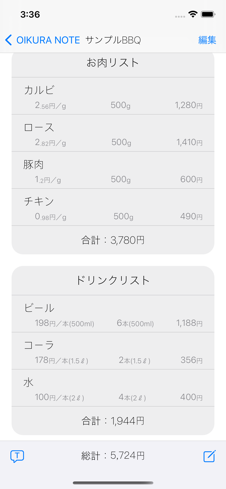
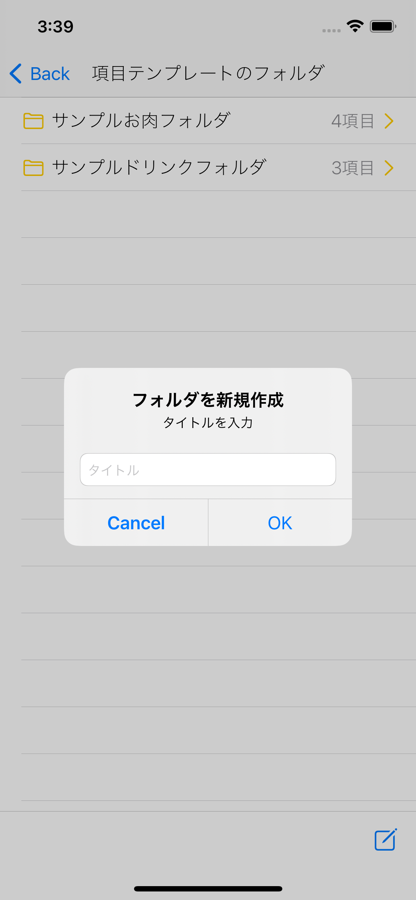
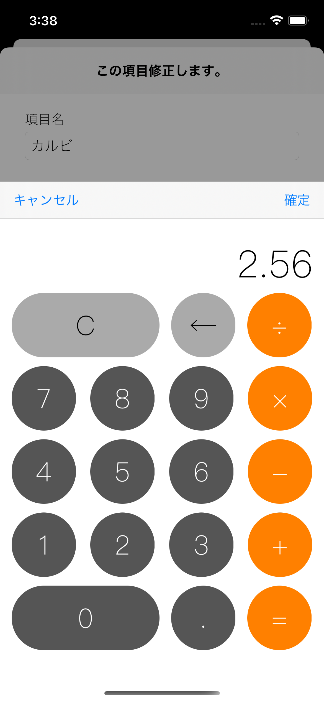
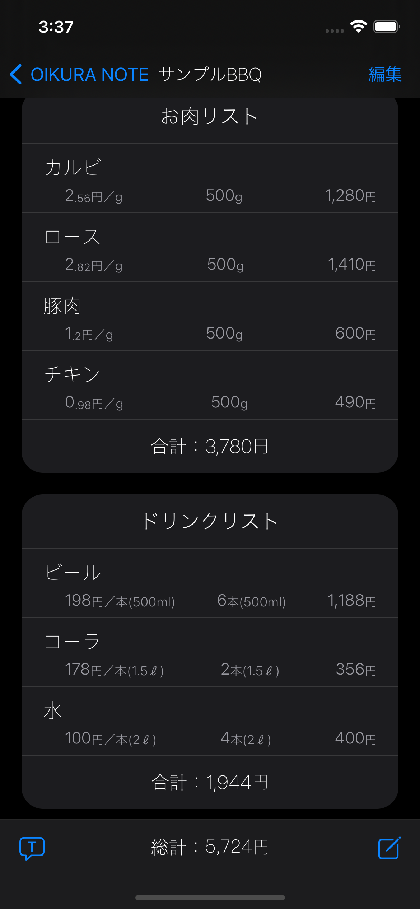
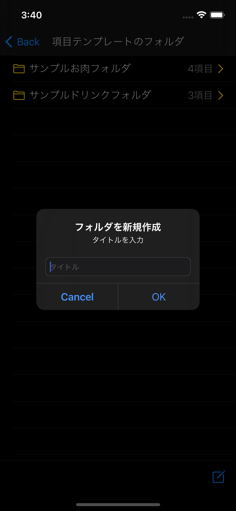
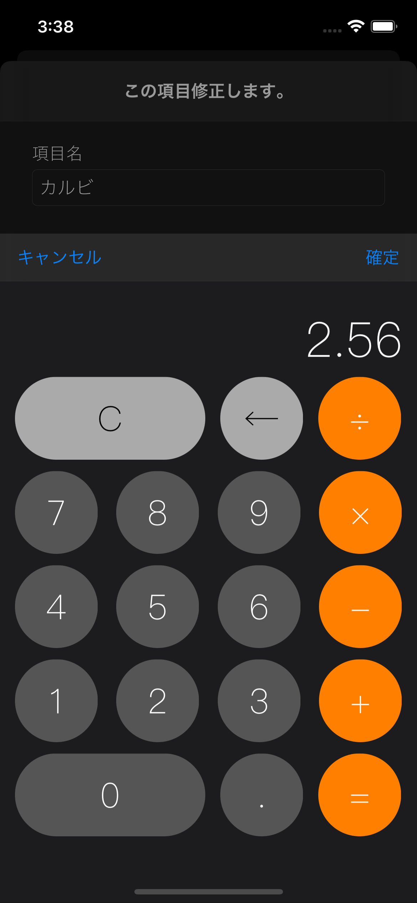

# DE OIKURA?

  「これとこれとこれと・・・」
「  で、おいくら？」

「じゃこれは3つ追加」
「こっちは無しで」
「こっちは2つ追加して頂戴」
「で、おいくら？」
  

  

## 合計金額に特化した表計算メモ！

  
### 色んなシーンで
- スーパーで目標金額に抑えたい
- 個数変更の度に電卓を叩きたくない
- スマホでSUMしたい
- コスパ計算機として
- 客先にて高速見積もり計算

### シンプルなデザイン
 - まるで標準アプリ
 - 慣れると手放せない

## スクリーンショット

### Light
|リスト画面|フォルダ作成|電卓入力|
|:--|:--|:--|
||||

### Dark
|リスト画面|フォルダ作成|電卓入力|
|:--|:--|:--|
||||
